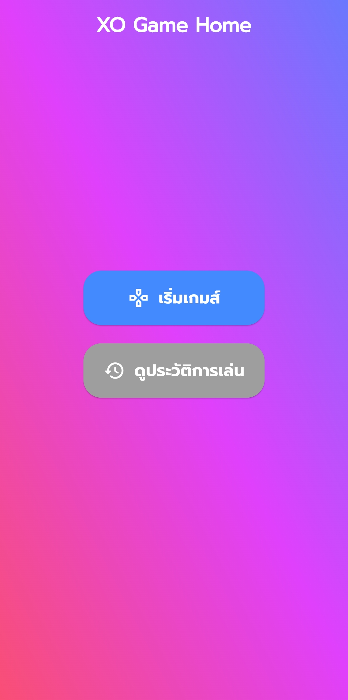
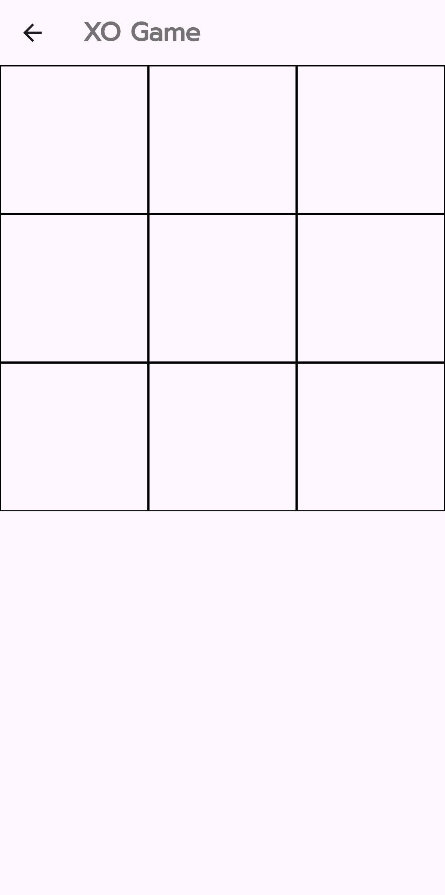
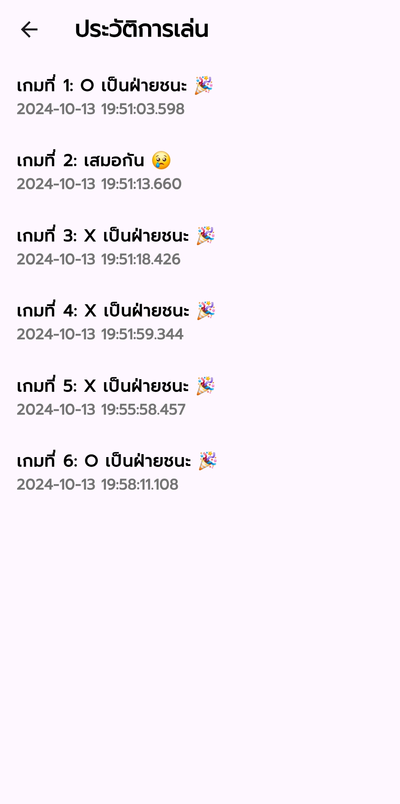
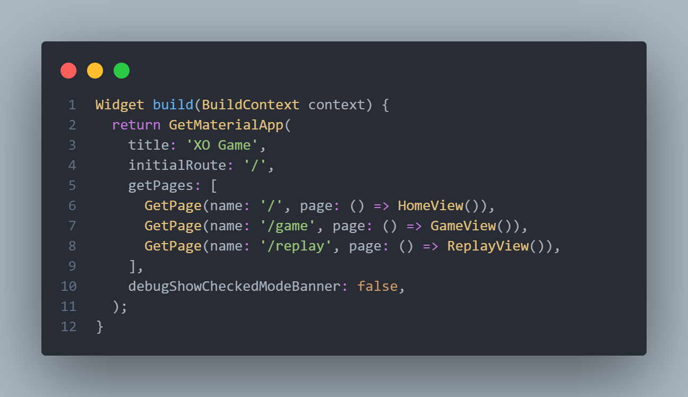
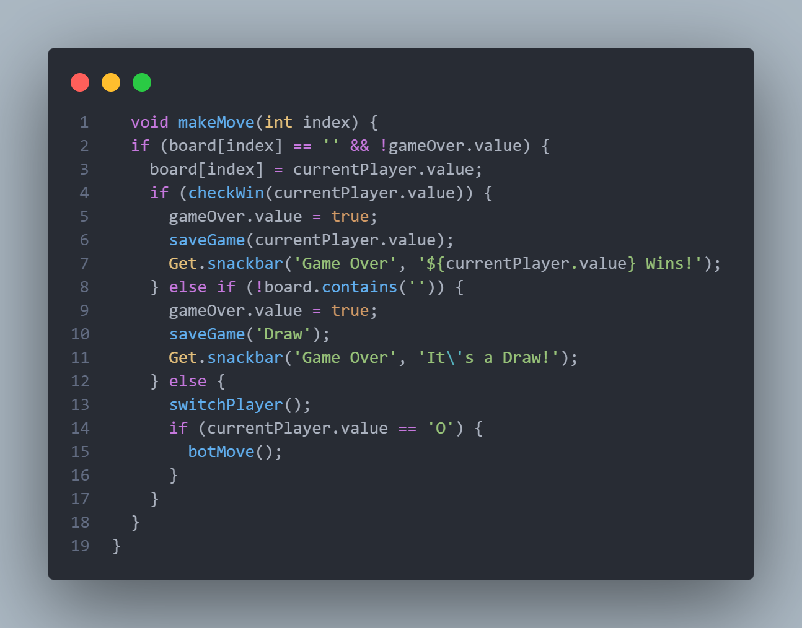
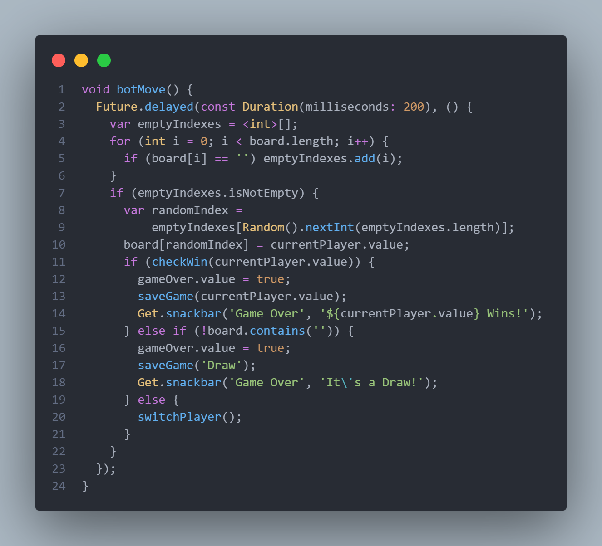
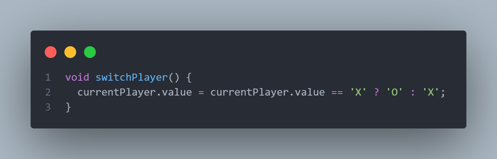
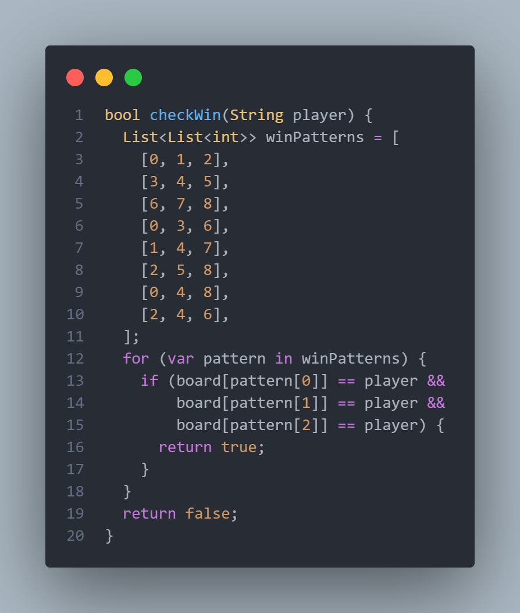
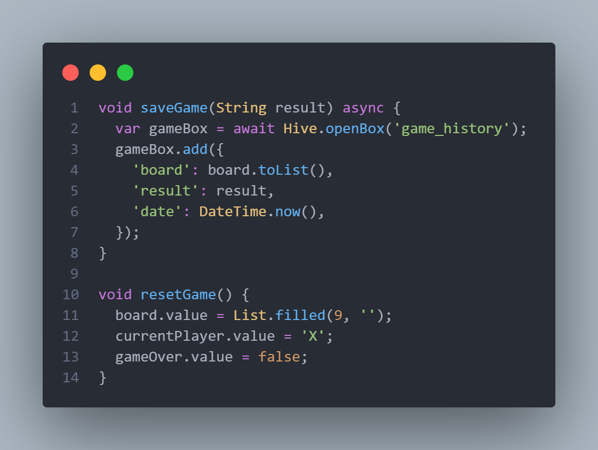

# Game xo

Project นี้เกี่ยวกับ game XO โดยการทำงานหลักๆมีดังนี้
1. สามารถดู replay หลังจากเล่นจบไปแล้วได้
2. มี bot ที่สามารถโต้ตอบผู้เล่นได้
โดยได้ใช้ packages ดังต่อไปนั้
1. getX ใช้ในการจัดการ State management ของตัว Project
2. Hive ใช้ในการเก็บข้อมูลประวัติการเล่นและ Replay
3. google_fonts ใช้ตกแต่ง Text ในตัว Project

## Table of Contents (สารบัญ)
1. [การติดตั้ง (Installation)](#การติดตั้ง)
2. [วิธีการใช้งาน (Usage)](#วิธีการใช้งาน)
3. [อธิบาย (Explain)](#อธิบาย)

## การติดตั้ง (Installation)
** ต้องมี flutter และ dart ก่อน
1. git clone https://github.com/BasSarayut/gamexo.git
2. เปิดตัว Project ด้วย vsCode
3. เลือก device *ถ้าไม่มีให้สร้าง emulator หรือ ใช้โทรศัพท์ที่เป็นระบบ android แล้วเปิด debug mode 
4. flutter run หรือ กด F5 เพื่อ run and debug

## วิธีการใช้งาน (Usage)

1. หน้า Home สามารถเลือก "เริ่มเกม" หรือ "ดูประวัติการเล่น" ได้

2. หน้าเล่นเกมถ้าเมื่อจบเกมจะมีปุ่มรีเซ็ตเพื่อเริ่มเล่นเกมใหม่ได้ทันที

3. หน้า Replay สามารถดูประวัติการเล่นที่เคยเล่นมา

## อธิบาย (Explain)

1. code ในหน้า main.dart จะใช้ Route management ของ getX เพื่อกำหนด page ของตัว Project

2. ฟังก์ชันนี้ใช้ในการจัดการเมื่อผู้เล่นทำการเล่นโดยจะตรวจสอบว่าช่องที่เลือกนั้นว่างอยู่หรือไม่ และตรวจสอบว่าเกมยังไม่จบ

3. ฟังก์ชันนี้จัดการการเล่นของ bot โดย bot เป็น O

4. ฟังก์ชันนี้ทำหน้าที่สลับผู้เล่นระหว่าง 'X' และ 'O'

5. ฟังก์ชันนี้ใช้ตรวจสอบว่าผู้เล่นที่ระบุ ('X' หรือ 'O') ชนะหรือไม่โดยการตรวจสอบกระดานกับรูปแบบการชนะที่กำหนดไว้ล่วงหน้า (เช่น ชนะในแถว คอลัมน์ หรือแนวทแยง)

6. saveGame ฟังก์ชันนี้ใช้ในการบันทึกผลลัพธ์ของเกมลงในฐานข้อมูล Hive
7. resetGame ฟังก์ชันนี้รีเซ็ตเกมเพื่อเริ่มใหม่